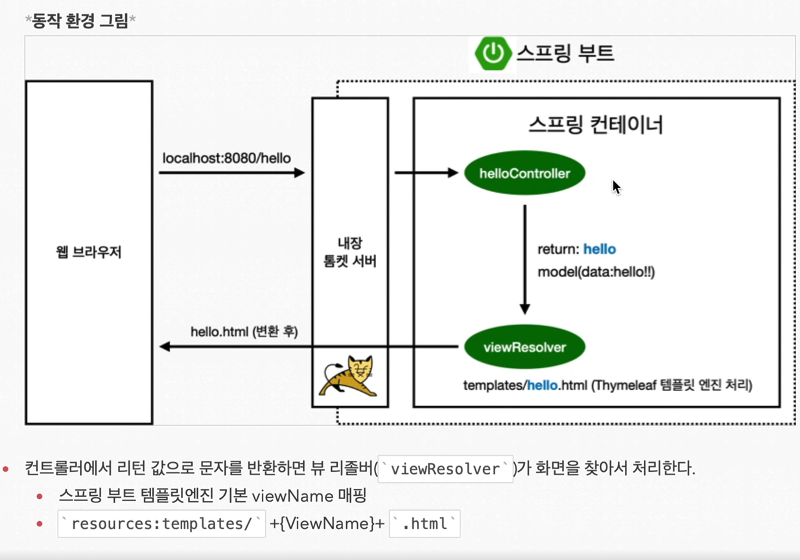

# View
스프링에서 resource의 static에 index.html파일을 생성하면 스프링 시작시에 이 파일을 처음 화면으로 보여준다.

Spring에는 기능은 어마어마한 종류의 기능이 존재한다. -> 필요한 것을 찾는 능력이 중요하다.\
spring.io에서 Spring boot docs로 필요한 기능을 검색하자 https://docs.spring.io/spring-boot/docs/3.0.0/reference/htmlsingle/

```
템플릿을 만드는 엔진 종류
FreeMarker
Groovy
Thymeleaf
Mustache
```

웹 어플리케이션에서 첫번째 진입점 -> 컨트롤러



기본적으로 컨트롤러에서 리턴 값으로 문자를 반환하면 뷰 리졸버가 화면을 찾아서 처리\
```
`resource:templates/` + {ViewName} + `.html`
```

빌드하고 실행하기
```
1. ./gradlew build
2. cd build/libs
3. java -jar hello-spring-0.0.1-SNAPSHOT.jar
4. 실행 확인

./gradlew clean -> 새로 빌드하기
```
개발 방식 : 
1. 정적 컨텐츠 : 그냥 서버에서 파일을 그대로 전달하는 방식
   - 컨트롤러 사용 X
2. MVC 템플릿 엔진 : JSP, PHP.. html을 서버에서 프로그래밍을 해서 (동적으로) 파일을 전달
   - 쿼리를 전달하기 abcde?var=number 이런방식!
   - resolver가 변환을 해서 html을 전달한다.(정적인 경우에는 변환 X)
3. API 방식 : JSON이라는 데이터 포맷으로 클라이언트에게 전달

모르는거는 어디에?? `https://docs.spring.io/spring-boot/docs/3.0.0/reference/htmlsingle/`

API 방식에서 raw 데이터를 줄 수도 있다.\
객체를 리턴하는 경우 json 형식으로 준다.

ResponseBody 어노테이션의 작동 방식
1. HTTP의 BODY에 문자 내용을 직접 반환
2. viewResolver 대신에 HttpMessageConverter가 동작
- 문자열 처리 - StringHttpMessageConverter가 동작
- 객체 처리 - MappingJackson2HttpMessageConverter
- byte 처리 및 등등 - HttpMessageConverter가 기본으로 등록되어 있다.

객체를 json으로 바꿔주는 대표적인 라이브러리
- Jackson
- Gson

일반적인 웹 어플리케이션의 계층 구조

```
컨트롤러 -> 서비스 -> 레포지토리 -> DB
\        |        /
  \     |       /
       도메인
```
컨트롤러 : 웹 MVC의 컨트롤러 역할\
서비스 : 핵심 비즈니스 로직 구현\
리포지토리 : 데이터 베이스에 접근, 도메인 객체를 DB에 저장, 관리\
도메인 : 비즈니스 도메인 객체(회원, 주문, 쿠폰.. 주로 데이터 베이스에 저장, 관리)

인터페이스 -> 구현 클래스를 변경할 수 있게 만듦